# fenliu
学生专业分流系统的设计

## **1.1**   **系统总体设计**

### **1.1.1** **系统功能简介**

分流系统主要是针对大学专业分流设计的系统，实现专业的自动分流与邮件通知

 

 

### **1.1.2** **系统功能框图**

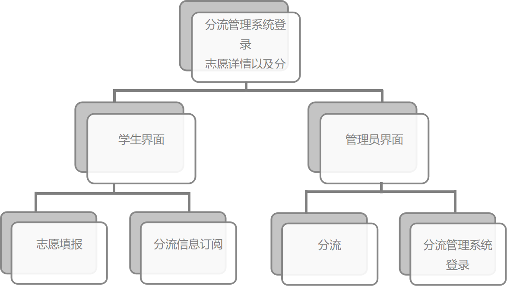

 

 

## **1.2** **数据库及表的设计**

本系统共有6张表。分别为用户表user，权限表role，专业表major,系表department,学院表college,志愿表aspiration

### **1.2.1**  **表结构****的设计**

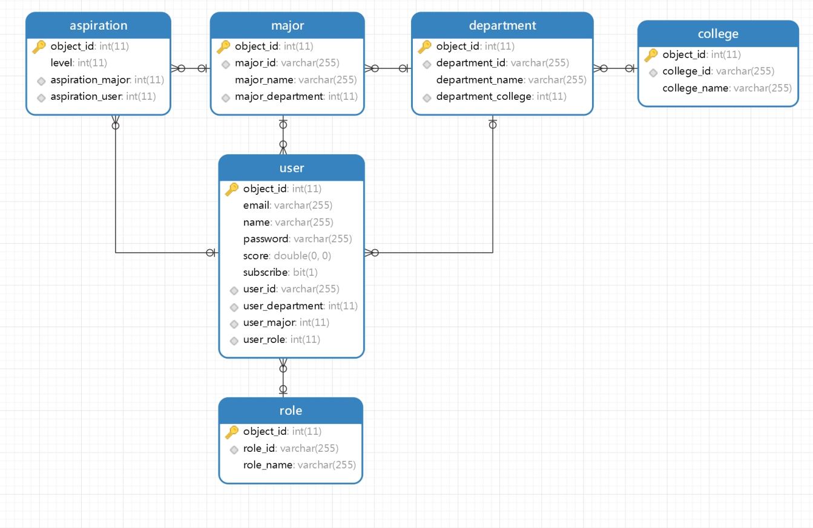 

### **1.2.2**  **数据库及表的建立**

数据库名：fenliu

创建如下6个表：

-- ----------------------------

-- Table structure for aspiration

-- ----------------------------

DROP TABLE IF EXISTS `aspiration`;

CREATE TABLE `aspiration`  (

  `object_id` int(11) NOT NULL AUTO_INCREMENT,

  `level` int(11) NOT NULL,

  `aspiration_major` int(11) NULL DEFAULT NULL,

  `aspiration_user` int(11) NULL DEFAULT NULL,

  PRIMARY KEY (`object_id`) USING BTREE,

  INDEX `FKfy8thvw00qbtlkxf4nftq0ud1`(`aspiration_major`) USING BTREE,

  INDEX `FK5jgadrwmme2630nmpg1w3nxjj`(`aspiration_user`) USING BTREE,

  CONSTRAINT `FK5jgadrwmme2630nmpg1w3nxjj` FOREIGN KEY (`aspiration_user`) REFERENCES `user` (`object_id`) ON DELETE RESTRICT ON UPDATE RESTRICT,

  CONSTRAINT `FKfy8thvw00qbtlkxf4nftq0ud1` FOREIGN KEY (`aspiration_major`) REFERENCES `major` (`object_id`) ON DELETE RESTRICT ON UPDATE RESTRICT

) ENGINE = InnoDB AUTO_INCREMENT = 50 CHARACTER SET = utf8 COLLATE = utf8_general_ci ROW_FORMAT = Dynamic;

 

-- ----------------------------

-- Records of aspiration

-- ----------------------------

INSERT INTO `aspiration` VALUES (47, 1, 1, 1);

INSERT INTO `aspiration` VALUES (48, 2, 2, 1);

INSERT INTO `aspiration` VALUES (49, 3, 3, 1);

 

-- ----------------------------

-- Table structure for college

-- ----------------------------

DROP TABLE IF EXISTS `college`;

CREATE TABLE `college`  (

  `object_id` int(11) NOT NULL AUTO_INCREMENT,

  `college_id` varchar(255) CHARACTER SET utf8 COLLATE utf8_general_ci NULL DEFAULT NULL,

  `college_name` varchar(255) CHARACTER SET utf8 COLLATE utf8_general_ci NULL DEFAULT NULL,

  PRIMARY KEY (`object_id`) USING BTREE,

  UNIQUE INDEX `UK_79reucg4dknkcctnijpw6axmi`(`college_id`) USING BTREE

) ENGINE = InnoDB AUTO_INCREMENT = 2 CHARACTER SET = utf8 COLLATE = utf8_general_ci ROW_FORMAT = Dynamic;

 

-- ----------------------------

-- Records of college

-- ----------------------------

INSERT INTO `college` VALUES (1, 'dqyxx', '电气与信息');

 

-- ----------------------------

-- Table structure for department

-- ----------------------------

DROP TABLE IF EXISTS `department`;

CREATE TABLE `department`  (

  `object_id` int(11) NOT NULL AUTO_INCREMENT,

  `department_id` varchar(255) CHARACTER SET utf8 COLLATE utf8_general_ci NULL DEFAULT NULL,

  `department_name` varchar(255) CHARACTER SET utf8 COLLATE utf8_general_ci NULL DEFAULT NULL,

  `department_college` int(11) NULL DEFAULT NULL,

  PRIMARY KEY (`object_id`) USING BTREE,

  UNIQUE INDEX `UK_21ujm2eubctgc9x652n0esnwa`(`department_id`) USING BTREE,

  INDEX `FK6je19aueow7lppnph34vy03ev`(`department_college`) USING BTREE,

  CONSTRAINT `FK6je19aueow7lppnph34vy03ev` FOREIGN KEY (`department_college`) REFERENCES `college` (`object_id`) ON DELETE RESTRICT ON UPDATE RESTRICT

) ENGINE = InnoDB AUTO_INCREMENT = 2 CHARACTER SET = utf8 COLLATE = utf8_general_ci ROW_FORMAT = Dynamic;

 

-- ----------------------------

-- Records of department

-- ----------------------------

INSERT INTO `department` VALUES (1, 'cs', '计算机科学与技术', 1);

 

-- ----------------------------

-- Table structure for major

-- ----------------------------

DROP TABLE IF EXISTS `major`;

CREATE TABLE `major`  (

  `object_id` int(11) NOT NULL AUTO_INCREMENT,

  `major_id` varchar(255) CHARACTER SET utf8 COLLATE utf8_general_ci NULL DEFAULT NULL,

  `major_name` varchar(255) CHARACTER SET utf8 COLLATE utf8_general_ci NULL DEFAULT NULL,

  `major_department` int(11) NULL DEFAULT NULL,

  PRIMARY KEY (`object_id`) USING BTREE,

  UNIQUE INDEX `UK_lf3ilcqm3ruau0tlugjp7c32j`(`major_id`) USING BTREE,

  INDEX `FKfgxtcxmm3nw7exyi05a53r459`(`major_department`) USING BTREE,

  CONSTRAINT `FKfgxtcxmm3nw7exyi05a53r459` FOREIGN KEY (`major_department`) REFERENCES `department` (`object_id`) ON DELETE RESTRICT ON UPDATE RESTRICT

) ENGINE = InnoDB AUTO_INCREMENT = 4 CHARACTER SET = utf8 COLLATE = utf8_general_ci ROW_FORMAT = Dynamic;

 

-- ----------------------------

-- Records of major

-- ----------------------------

INSERT INTO `major` VALUES (1, 'ui', 'UI设计师', 1);

INSERT INTO `major` VALUES (2, 'front', '前端', 1);

INSERT INTO `major` VALUES (3, 'soft', '软件工程师', 1);

 

-- ----------------------------

-- Table structure for role

-- ----------------------------

DROP TABLE IF EXISTS `role`;

CREATE TABLE `role`  (

  `object_id` int(11) NOT NULL AUTO_INCREMENT,

  `role_id` varchar(255) CHARACTER SET utf8 COLLATE utf8_general_ci NULL DEFAULT NULL,

  `role_name` varchar(255) CHARACTER SET utf8 COLLATE utf8_general_ci NULL DEFAULT NULL,

  PRIMARY KEY (`object_id`) USING BTREE,

  UNIQUE INDEX `UK_nvt31tls2ym5so7gx2s6gopi0`(`role_id`) USING BTREE

) ENGINE = InnoDB AUTO_INCREMENT = 3 CHARACTER SET = utf8 COLLATE = utf8_general_ci ROW_FORMAT = Dynamic;

 

-- ----------------------------

-- Records of role

-- ----------------------------

INSERT INTO `role` VALUES (1, 'STUDENT', '学生');

INSERT INTO `role` VALUES (2, 'ADMIN', '管理员');

 

-- ----------------------------

-- Table structure for user

-- ----------------------------

DROP TABLE IF EXISTS `user`;

CREATE TABLE `user`  (

  `object_id` int(11) NOT NULL AUTO_INCREMENT,

  `email` varchar(255) CHARACTER SET utf8 COLLATE utf8_general_ci NULL DEFAULT NULL,

  `name` varchar(255) CHARACTER SET utf8 COLLATE utf8_general_ci NULL DEFAULT NULL,

  `password` varchar(255) CHARACTER SET utf8 COLLATE utf8_general_ci NULL DEFAULT NULL,

  `score` double NOT NULL,

  `subscribe` bit(1) NULL DEFAULT NULL,

  `user_id` varchar(255) CHARACTER SET utf8 COLLATE utf8_general_ci NULL DEFAULT NULL,

  `user_department` int(11) NULL DEFAULT NULL,

  `user_major` int(11) NULL DEFAULT NULL,

  `user_role` int(11) NULL DEFAULT NULL,

  PRIMARY KEY (`object_id`) USING BTREE,

  UNIQUE INDEX `UK_a3imlf41l37utmxiquukk8ajc`(`user_id`) USING BTREE,

  INDEX `FKbgnpw5erbnf2s59xko55ny7xw`(`user_department`) USING BTREE,

  INDEX `FKgrgqullkikk4wfj8nsyysydy8`(`user_major`) USING BTREE,

  INDEX `FKied680nuc33futf3pbwdsyihr`(`user_role`) USING BTREE,

  CONSTRAINT `FKbgnpw5erbnf2s59xko55ny7xw` FOREIGN KEY (`user_department`) REFERENCES `department` (`object_id`) ON DELETE RESTRICT ON UPDATE RESTRICT,

  CONSTRAINT `FKgrgqullkikk4wfj8nsyysydy8` FOREIGN KEY (`user_major`) REFERENCES `major` (`object_id`) ON DELETE RESTRICT ON UPDATE RESTRICT,

  CONSTRAINT `FKied680nuc33futf3pbwdsyihr` FOREIGN KEY (`user_role`) REFERENCES `role` (`object_id`) ON DELETE RESTRICT ON UPDATE RESTRICT

) ENGINE = InnoDB AUTO_INCREMENT = 4 CHARACTER SET = utf8 COLLATE = utf8_general_ci ROW_FORMAT = Dynamic;

 

-- ----------------------------

-- Records of user

-- ----------------------------

INSERT INTO `user` VALUES (1, '1838383210@qq.com', '梁亚龙', '$2a$10$Xuo3BR0nUM7AEo.2t2daHukukQCzEJcXD.mgclr1Pksa.B6NS/MZC', 0, b'1', '20164081112', 1, 3, 1);

INSERT INTO `user` VALUES (3, NULL, '管理员', '$2a$10$Xuo3BR0nUM7AEo.2t2daHukukQCzEJcXD.mgclr1Pksa.B6NS/MZC', 0, b'1', 'admin', 1, NULL, 2);

 

SET FOREIGN_KEY_CHECKS = 1;

 

## **1.3**  **系统功能实现图解**

### **1.3.1** **系统登录页面**

管理员登录：

用户名：admin

登录密码：123456

注：用户名以及密码已设计好，正确输入验证码后直接点击“登录”按钮即可。

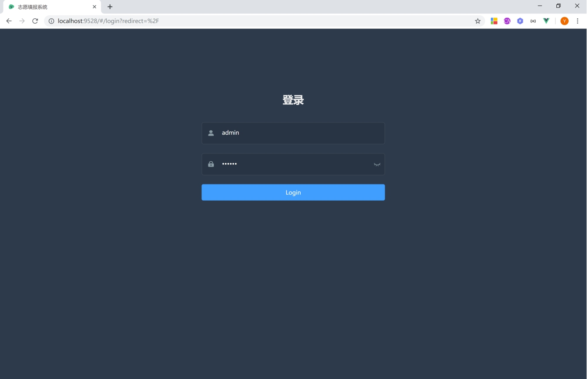 

图1

### **1.3.2**  **管理员****系统主界面**

 

图2f

### **1.3.3** **分流****的功能实现**

#### **1.3.3.1** **点击分流按钮**

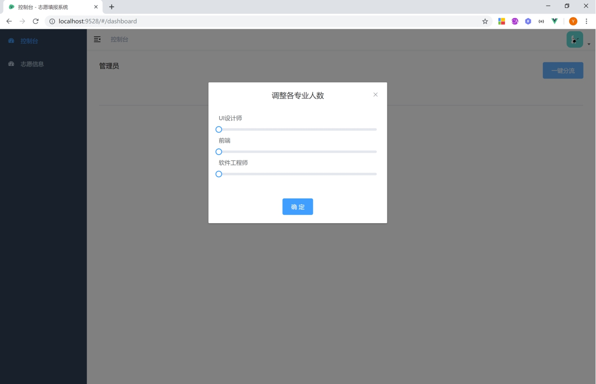 

点击确定直接开始分流 并对订阅的学生发送邮件

#### **1.3.3.2** **查看志愿信息以及分流情况**

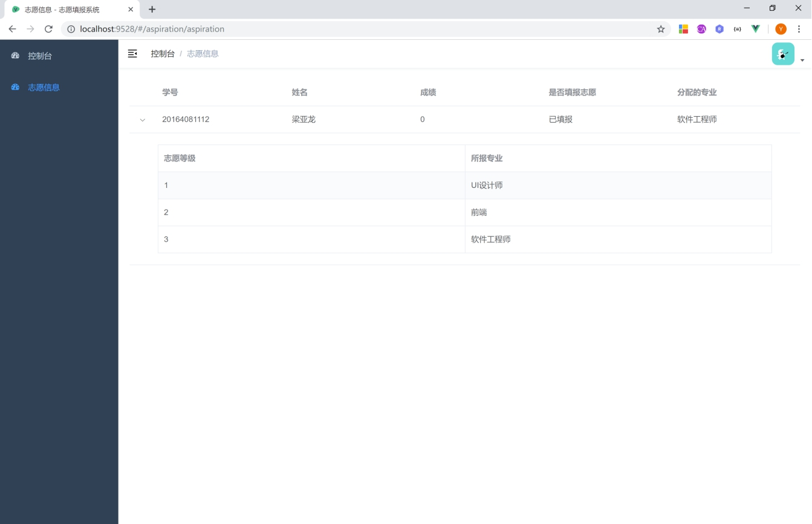 

### **1.3.4**  **学生界面**

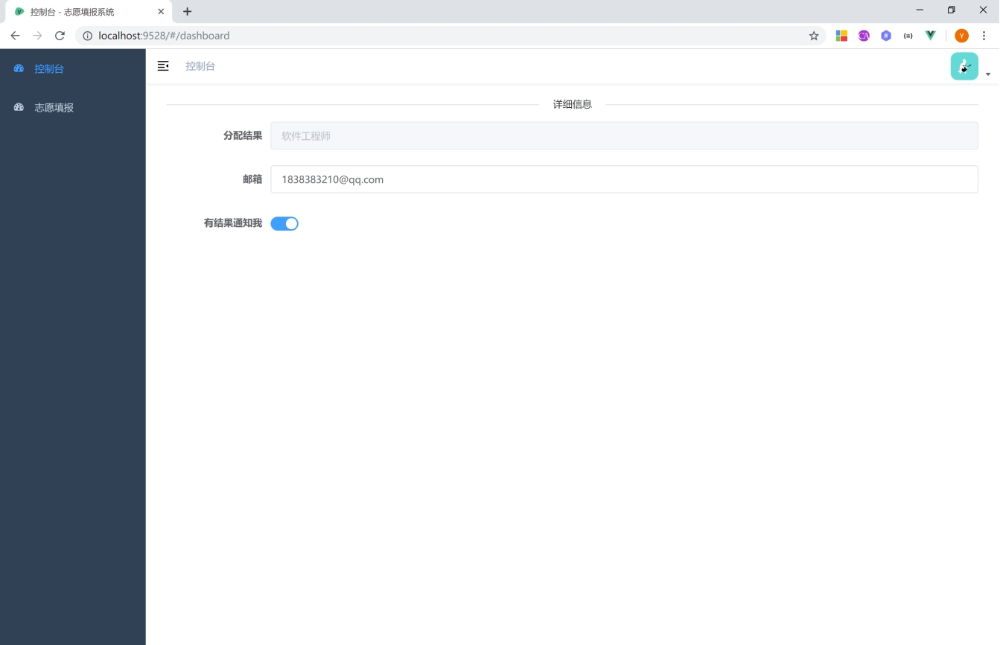 

#### **1.3.4.1**  **学生信息设置**

 

#### **1.3.4.2** **志愿填报**

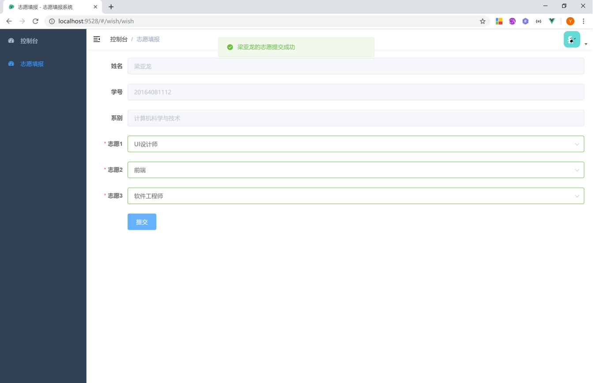 

 

### **1.3.5**  **退出登录的实现**

 

点击退出登录的链接，即可看到回到了页面。

 

## **1.4**  **系统编码**

UTF-8

 

### **1.4.1** **后端文件****结构**

 

 

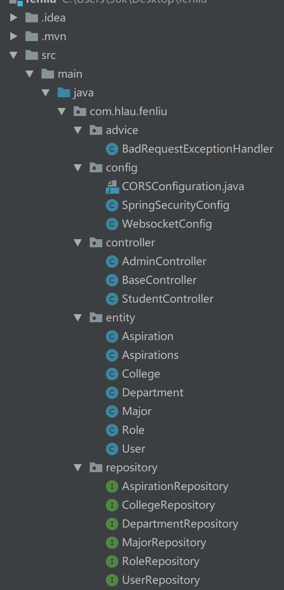 

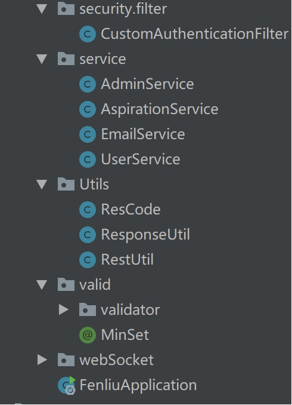 

### **1.4.2** **前端项目采用vue开发**

前端项目采用vue-element-admin 二次开发

项目结构：

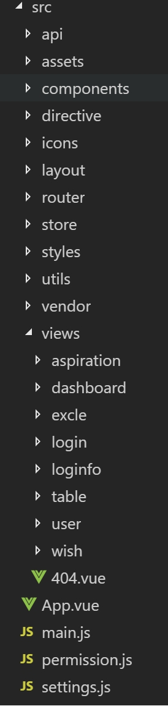 

其中 api里面放api文件

Assets 静态资源文件

Directive vue全局指令

Icons 图标资源目录

Store 统一变量

Utils 工具方法

Views 页面文件

Main.js 入口文件

Perminssion .js 全局权限控制

另：

 

此文件为动态路由获取方法

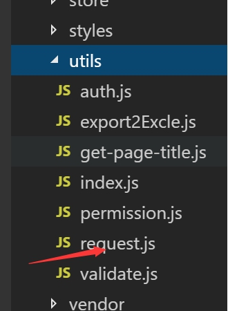 

