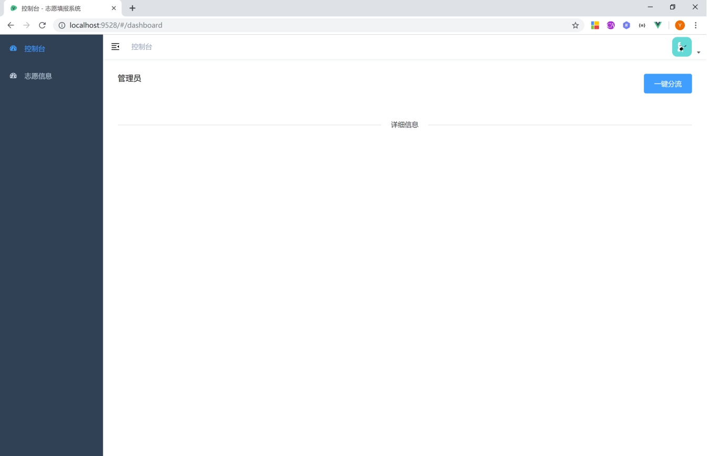
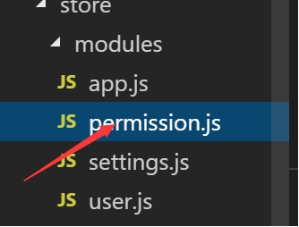

# fenliu
学生专业分流系统的设计

## **1.1**   **系统总体设计**

### **1.1.1** **系统功能简介**

分流系统主要是针对大学专业分流设计的系统，实现专业的自动分流与邮件通知

 

 

### **1.1.2** **系统功能框图**

 

 

## **1.2** **数据库及表的设计**

本系统共有6张表。分别为用户表user，权限表role，专业表major,系表department,学院表college,志愿表aspiration

### **1.2.1**  **表结构的设计**

 

 

## **1.3**  **系统功能实现图解**

### **1.3.1** **系统登录页面**

管理员登录：

用户名：admin

登录密码：123456

注：用户名以及密码已设计好，正确输入验证码后直接点击“登录”按钮即可。

 

图1

### **1.3.2**  **管理员****系统主界面**

 

图2f

### **1.3.3** **分流**的功能实现

#### **1.3.3.1** **点击分流按钮**

 

点击确定直接开始分流 并对订阅的学生发送邮件

#### **1.3.3.2** **查看志愿信息以及分流情况**

 

### **1.3.4**  **学生界面**

 

#### **1.3.4.1**  **学生信息设置**

 

#### **1.3.4.2** **志愿填报**

 

 

### **1.3.5**  **退出登录的实现**

 

点击退出登录的链接，即可看到回到了页面。

 

## **1.4**  **系统编码**

UTF-8

 

### **1.4.1** **后端文件**结构

 

 

 

 

### **1.4.2** **前端项目采用vue开发**

前端项目采用vue-element-admin 二次开发

项目结构：

 

其中 api里面放api文件

Assets 静态资源文件

Directive vue全局指令

Icons 图标资源目录

Store 统一变量

Utils 工具方法

Views 页面文件

Main.js 入口文件

Perminssion .js 全局权限控制

另：

 

此文件为动态路由获取方法

 